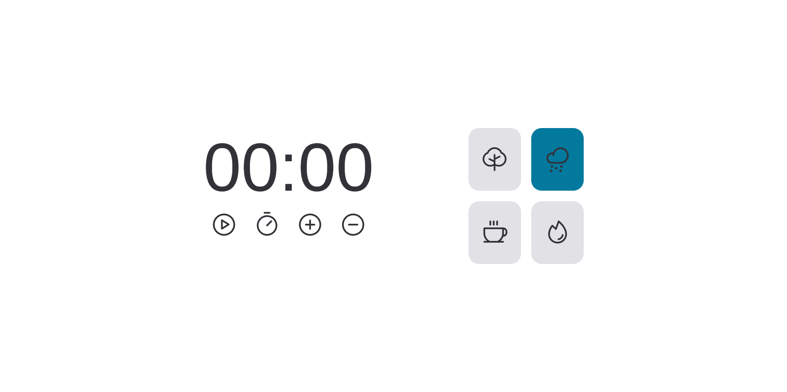

<h1 align="center"> Desafio FocusTimer - Versão 2.0 </h1>

Projeto desenvolvido individualmente durante os estudos do Stage 5 na trilha Explorer da Rocketseat. Cronômetro onde tem os botões de: iniciar, pausar, ajustar, adicionar/remover 5 minutos, e por fim escolher o tipo de som de fundo, que são: floresta, chuva, cafeteria e lareira.

  

#### Esse projeto foi desenvolvido com as seguintes tecnologias:

- HTML
- CSS
- Figma
- JavaScript
- Git e Github
